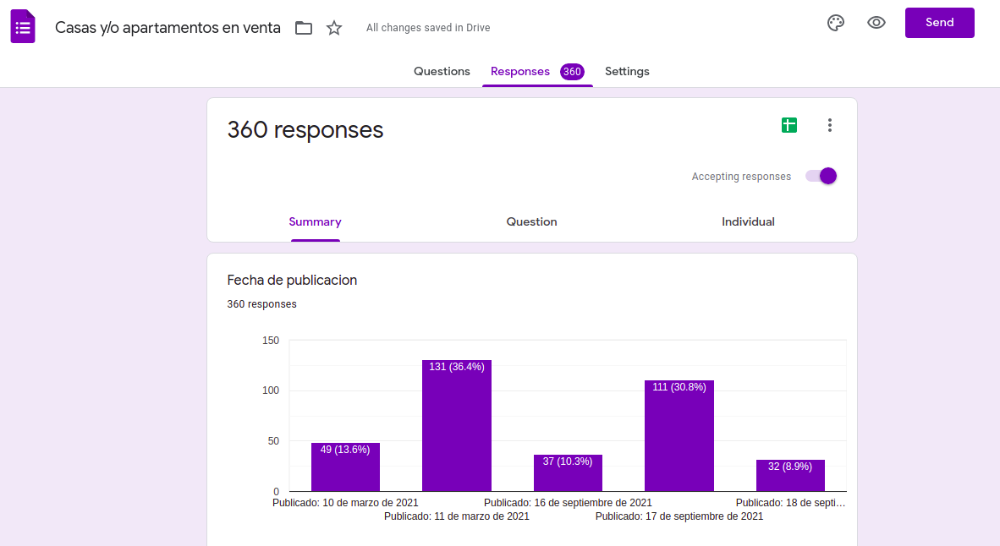

# Crawler for Houses

A Crawler built with python that was intended for an specific website, corotos.com, so the selectors are directly towards elements on that website, searching the first 5 pages and then save the results in a google form created previously by the user.





## Built With
- Python


### Python packages

- bs4
- requests
- selenium
- time
- re


## Author

- 👤GitHub: [Jose Abel Ramirez](https://github.com/jose-Abel)
- Linkedin: [Jose Abel Ramirez Frontany](https://www.linkedin.com/in/jose-abel-ramirez-frontany-7674a842/)


## Getting Started

To download the project either can do it with with git clone command:

git clone <repository_link>

Open the main.py script first to set up some variables. The Chrome Driver used was added to this repo so the path will be the root folder path:

```
	CHROME_DRIVER_PATH = "./chromedriver"
	USER_AGENT = ""
	ACCEPT_LANGUAGE = ""
	DOMAIN_URL = ""
	MAIN_SEARCHED_WEBSITE = ""
	A_TAGS_CLASS = ""
	PUBLISH_DATE_ELEMENT = ""
	PUBLISH_DATE_CLASS = ""
	STREET_ELEMENT = ""
	STREET_ELEMENT_CLASS = ""
	STREET_ELEMENT2 = ""
	STREET_ELEMENT_CLASS2 = ""
	CITY_ELEMENT = ""
	CITY_ELEMENT_CLASS = ""
	PRICE_ELEMENT = ""
	PRICE_ELEMENT_CLASS = ""
	NEXT_PAGE_SELECTOR = ""
	URL_TO_YOUR_GOOGLE_FORM = ""
	PUBLISH_DATE_XPATH = ""
	ADDRESS_XPATH = ""
	PRICE_XPATH = ""
	LINK_XPATH = ""
	SUBMIT_BUTTON_XPATH = ""
```


After setting up those variables, create a google form, copy the XPATH necesary to set up the previous variables, such as:

```
	URL_TO_YOUR_GOOGLE_FORM = ""
	PUBLISH_DATE_XPATH = ""
	ADDRESS_XPATH = ""
	PRICE_XPATH = ""
	LINK_XPATH = ""
	SUBMIT_BUTTON_XPATH = ""
```


Go to the website that wants to crawl, this project was used to crawl specifically https://corotos.com.do but you could change the code accordingly to crawl the one you're looking for.


After all the setup, run 

```
	sudo python3 ./main.py
```

After running it go to the google form created, click on the "edit form" button at the bottom right corner and check your responses, the responses can be exported to an Excel sheet.


## 📝 License

This project is MIT licensed.

## Show your support

Give a ⭐️ if you like this project!
